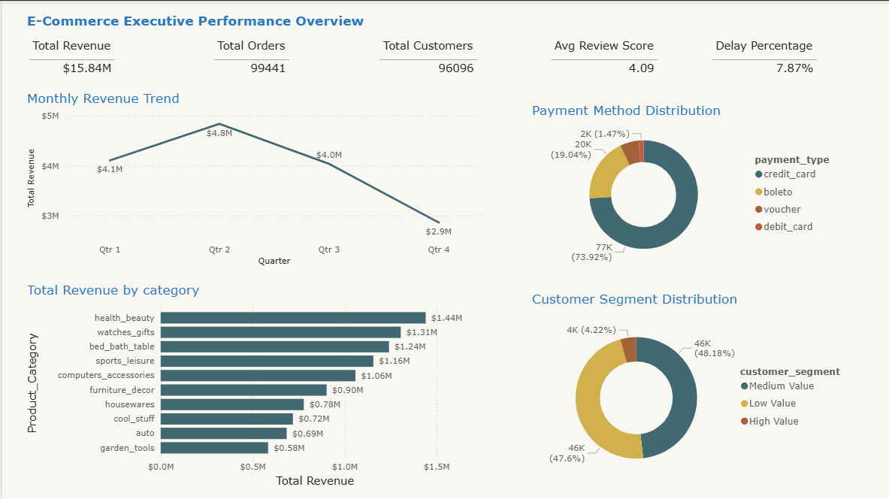
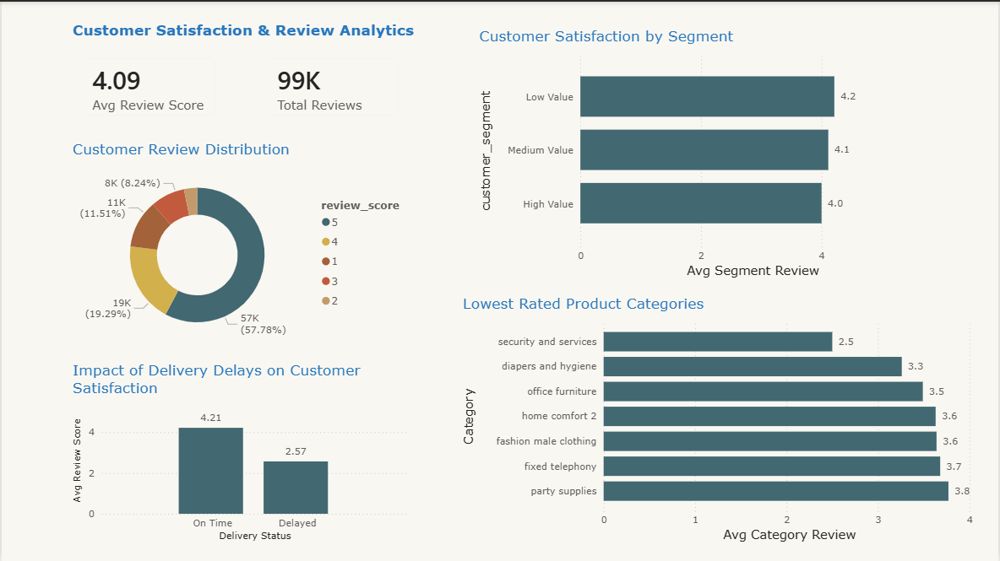
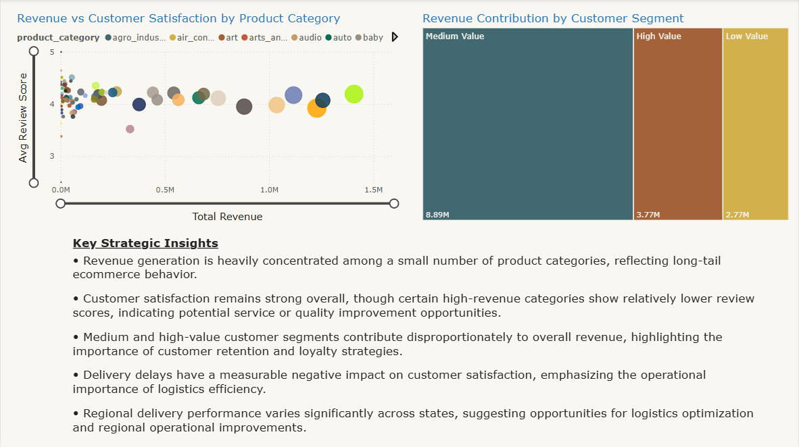

# E-Commerce Business Intelligence Dashboard

## Project Overview

This project is an end-to-end Business Intelligence solution built using SQL and Power BI to analyze e-commerce business performance across revenue, customer behavior, logistics operations, and strategic business insights.

The dashboard transforms raw operational data into interactive executive-level analytics capable of supporting data-driven business decisions.

---

# Business Problem

E-commerce businesses generate large volumes of operational data across:

* customer transactions
* delivery operations
* payment systems
* seller performance
* product categories
* customer reviews

However, raw data alone does not provide actionable business intelligence.

This project addresses that challenge by building a complete analytics pipeline that:

* cleans and transforms raw business data
* creates analytical business metrics
* visualizes operational performance
* identifies customer satisfaction drivers
* highlights strategic business opportunities

---

# Tools & Technologies Used

| Technology    | Purpose                                            |
| ------------- | -------------------------------------------------- |
| SQL           | Data cleaning and transformation                   |
| Power BI      | Dashboard development and visualization            |
| DAX           | KPI calculations and analytical measures           |
| Data Modeling | Relationship management and analytical structuring |

---

# Dashboard Pages

## 1. Executive Overview

Provides high-level business performance monitoring through:

* Revenue KPIs
* Revenue trends
* Product category performance
* Payment method distribution
* Customer segment distribution

### Key Business Focus

Overall business health and revenue performance.

---

## 2. Customer Analytics

Analyzes customer satisfaction and review behavior through:

* Review score distribution
* Customer satisfaction by segment
* Impact of delivery delays on reviews
* Lowest-rated product categories

### Key Business Focus

Understanding customer experience drivers.

---

## 3. Operations & Delivery Performance

Focuses on operational efficiency and logistics analytics through:

* Delivery KPIs
* Seller performance analysis
* Delivery trend monitoring
* Regional delivery delay analysis

### Key Business Focus

Operational efficiency and fulfillment performance.

---

## 4. Strategic Business Insights

Combines analytical findings into strategic business intelligence through:

* Revenue vs satisfaction analysis
* Revenue contribution by customer segment
* Executive strategic insights

### Key Business Focus

Business optimization and decision support.

---

# Key Insights Generated

* Revenue generation is concentrated among a small number of product categories.
* Delivery delays significantly reduce customer satisfaction.
* Medium and high-value customers contribute disproportionately to total revenue.
* Operational performance improved over time but regional inefficiencies remain.
* Certain high-revenue categories show relatively lower customer satisfaction.

---

# Project Workflow

## 1. Data Cleaning (SQL)

* handled null values
* transformed raw datasets
* created analytical views
* engineered customer segments
* standardized business labels

---

## 2. Data Modeling (Power BI)

* created table relationships
* designed star-schema style analytics structure
* optimized filtering interactions

---

## 3. KPI Engineering (DAX)

Created measures for:

* Total Revenue
* Total Orders
* Total Customers
* Delay Percentage
* Average Review Score
* Delivery Performance Metrics

---

## 4. Dashboard Storytelling

Designed interactive business dashboards focused on:

* executive reporting
* customer intelligence
* operational monitoring
* strategic recommendations

---

# Screenshots

## Executive Overview



---

## Customer Analytics



---

## Operations & Delivery Performance


---

## Strategic Business Insights



---

# Repository Structure

```bash
ecommerce-business-intelligence-dashboard/
│
├── data/
├── dashboard/
├── screenshots/
├── documentation/
├── sql/
└── README.md
```

---

# Learning Outcomes

This project strengthened practical skills in:

* SQL data transformation
* Power BI dashboard development
* DAX calculations
* business storytelling
* analytical thinking
* executive reporting
* operational analytics

---

# Author

Vajraa
